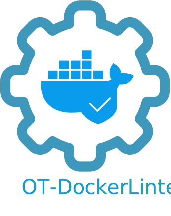

<p align="left">
  
</p>

[](https://github.com/opstree/OT-Dockerlinter)
[](http://golang.org)

[](https://goreportcard.com/report/github.com/opstree/OT-Dockerlinter)
[](LICENSE)


OT-Dockerlinter helps you in writing a Dockerfile with best practices. This tools can be integrated with your container native CI pipeline for Dockerfile's static code analysis and reporting.

### Supported Features

- Dockefile linting and reporting in different formats like table, json
- Integration with Jenkins(In Development Mode)
- Cross platform support is available
- Dockerfile best practices and recommendation

## Quickstart

A quickstart guide for installing, using and managing OT-Dockerlinter.

### Installation

OT-Dockerlinter installation packages can be found inside [Releases](https://github.com/opstree/OT-Dockerlinter/releases)

Supported Platforms:-

- Linux and Windows Platform with supported architecture types:-
  - AMD64
  - ARM63
  - AMD32Bit
  - ARM32Bit

For installation on debian and redhat based system, `.deb` and `.rpm` packages can be used.

### Available Options

There are help page available for ot-dockerlinter which can be called by `help` or `--help` command.

```shell
A tool for checking Dockerfile best practices.

Usage:
  ot-docker-linter [flags]
  ot-docker-linter [command]

Available Commands:
  audit       Runs ot-docker-linter audit
  help        Help about any command
  version     Prints the current version.

Flags:
  -h, --help                help for ot-docker-linter
      --log.format string   ot-docker-linter log format. (default "text")
      --log.level string    ot-docker-linter logging level. (default "info")

Use "ot-docker-linter [command] --help" for more information about a command.
```

### Using Linter

Simply specify the path of Dockerfile

```shell
$ ot-docker-linter audit --docker.file testing/Dockerfile.testing
```

<details>
<summary>Output</summary>

```shell
+-------------+------------------------------+-------------+--------------------------------+----------+----------------------------+
| LINE NUMBER |             LINE             |    CODE     |          DESCRIPTION           | SEVERITY |          FILENAME          |
+-------------+------------------------------+-------------+--------------------------------+----------+----------------------------+
| 3           | WORKDIR spsp/                | DL3000      | Use absolute WORKDIR.          | Error    | testing/Dockerfile.testing |
+-------------+------------------------------+-------------+--------------------------------+----------+----------------------------+
| 5           | RUN sudo apt-get update && \ | DL3001      | For some bash commands it      | Info     | testing/Dockerfile.testing |
|             |                              |             | makes no sense running them    |          |                            |
|             |                              |             | in a Docker container like     |          |                            |
|             |                              |             | `free`, `ifconfig`, `kill`,    |          |                            |
|             |                              |             | `mount`, `ps`, `service`,      |          |                            |
|             |                              |             | `shutdown`, `ssh`, `top`,      |          |                            |
|             |                              |             | `vim`.                         |          |                            |
+-------------+------------------------------+-------------+--------------------------------+----------+----------------------------+
| 8           | USER root                    | DL3002      | Last USER should not be root.  | Warning  | testing/Dockerfile.testing |
+-------------+------------------------------+-------------+--------------------------------+----------+----------------------------+
| 5           | RUN sudo apt-get update && \ | DL3004      | Do not use sudo as it leads    | Error    | testing/Dockerfile.testing |
|             |                              |             | to unpredictable behavior. Use |          |                            |
|             |                              |             | a tool like gosu to enforce    |          |                            |
|             |                              |             | root.                          |          |                            |
+-------------+------------------------------+-------------+--------------------------------+----------+----------------------------+
| 1           | FROM ubuntu:latest           | DL3007      | Using latest is prone to       | Warning  | testing/Dockerfile.testing |
|             |                              |             | errors if the image will       |          |                            |
|             |                              |             | ever update. Pin the version   |          |                            |
|             |                              |             | explicitly to a release tag.   |          |                            |
+-------------+------------------------------+-------------+--------------------------------+----------+----------------------------+
| 5           | RUN sudo apt-get update && \ | DL3008      | Pin versions in apt            | Warning  | testing/Dockerfile.testing |
|             |                              |             | get install. Instead of        |          |                            |
|             |                              |             | `apt-get install <package>`    |          |                            |
|             |                              |             | use `apt-get install           |          |                            |
|             |                              |             | <package>=<version>`.          |          |                            |
+-------------+------------------------------+-------------+--------------------------------+----------+----------------------------+
| 5           | RUN sudo apt-get update && \ | DL3009      | Delete the apt-get lists after | Info     | testing/Dockerfile.testing |
|             |                              |             | installing something.          |          |                            |
+-------------+------------------------------+-------------+--------------------------------+----------+----------------------------+
| 5           | RUN sudo apt-get update && \ | DL3014      | Use the `-y` switch to avoid   | Warning  | testing/Dockerfile.testing |
|             |                              |             | manual input `apt-get -y       |          |                            |
|             |                              |             | install <package>`.            |          |                            |
+-------------+------------------------------+-------------+--------------------------------+----------+----------------------------+
| 5           | RUN sudo apt-get update && \ | DL3015      | Avoid additional               | Info     | testing/Dockerfile.testing |
|             |                              |             | packages by specifying         |          |                            |
|             |                              |             | `--no-install-recommends`.     |          |                            |
+-------------+------------------------------+-------------+--------------------------------+----------+----------------------------+
```
</details>

To generate results in JSON format

```shell
$ ot-docker-linter audit --docker.file testing/Dockerfile.testing -o json
```

<details>
<summary>JSON Output</summary>

```json
[{
	"line_number": 3,
	"line": "WORKDIR spsp/",
	"code": "DL3000",
	"description": "Use absolute WORKDIR.",
	"message": "",
	"severity": "Error",
	"file": "testing/Dockerfile.testing"
}, {
	"line_number": 5,
	"line": "RUN sudo apt-get update \u0026\u0026 \\",
	"code": "DL3001",
	"description": "For some bash commands it makes no sense running them in a Docker container like `free`, `ifconfig`, `kill`, `mount`, `ps`, `service`, `shutdown`, `ssh`, `top`, `vim`.",
	"message": "",
	"severity": "Info",
	"file": "testing/Dockerfile.testing"
}, {
	"line_number": 8,
	"line": "USER root",
	"code": "DL3002",
	"description": "Last USER should not be root.",
	"message": "",
	"severity": "Warning",
	"file": "testing/Dockerfile.testing"
}, {
	"line_number": 5,
	"line": "RUN sudo apt-get update \u0026\u0026 \\",
	"code": "DL3004",
	"description": "Do not use sudo as it leads to unpredictable behavior. Use a tool like gosu to enforce root.",
	"message": "",
	"severity": "Error",
	"file": "testing/Dockerfile.testing"
}, {
	"line_number": 1,
	"line": "FROM ubuntu:latest",
	"code": "DL3007",
	"description": "Using latest is prone to errors if the image will ever update. Pin the version explicitly to a release tag.",
	"message": "",
	"severity": "Warning",
	"file": "testing/Dockerfile.testing"
}, {
	"line_number": 5,
	"line": "RUN sudo apt-get update \u0026\u0026 \\",
	"code": "DL3008",
	"description": "Pin versions in apt get install. Instead of `apt-get install \u003cpackage\u003e` use `apt-get install \u003cpackage\u003e=\u003cversion\u003e`.",
	"message": "",
	"severity": "Warning",
	"file": "testing/Dockerfile.testing"
}, {
	"line_number": 5,
	"line": "RUN sudo apt-get update \u0026\u0026 \\",
	"code": "DL3009",
	"description": "Delete the apt-get lists after installing something.",
	"message": "",
	"severity": "Info",
	"file": "testing/Dockerfile.testing"
}, {
	"line_number": 5,
	"line": "RUN sudo apt-get update \u0026\u0026 \\",
	"code": "DL3014",
	"description": "Use the `-y` switch to avoid manual input `apt-get -y install \u003cpackage\u003e`.",
	"message": "",
	"severity": "Warning",
	"file": "testing/Dockerfile.testing"
}, {
	"line_number": 5,
	"line": "RUN sudo apt-get update \u0026\u0026 \\",
	"code": "DL3015",
	"description": "Avoid additional packages by specifying `--no-install-recommends`.",
	"message": "",
	"severity": "Info",
	"file": "testing/Dockerfile.testing"
}]
```
</details>

### Roadmap

- [ ] Add project badges in README
- [ ] Fixed all linters warnings
- [ ] Add CI workflow for linter
- [ ] Add JSON support in Jenkins warnings-ng plugin
- [ ] Add more rules in checklist
- [ ] Create a Jenkins shared library function to call it inside the Jenkinsfile

### Contact

If you have any suggestion or query. Contact us at

opensource@opstree.com
